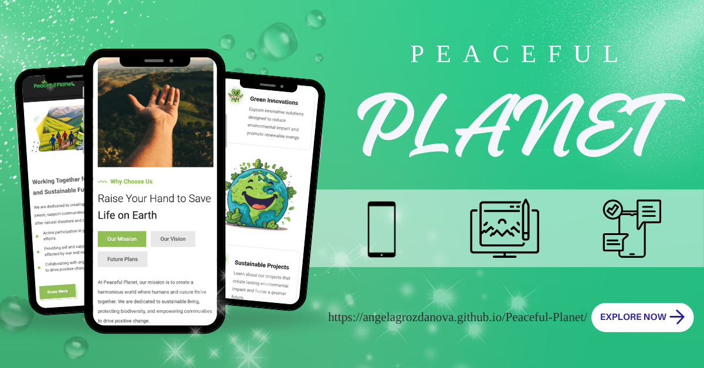

  

<h1 align="center">🌍 Peaceful Planet 🌍</h1>

    A multilingual educational platform that highlights social initiatives, impactful projects, and globally-oriented events.

---

    <b>Technologies Used</b>

    
    
    

---

## 📖 About

**Peaceful Planet** is a multilingual educational website built to promote awareness and engagement with global issues.  
Its goal is to present **social initiatives**, **community-driven projects**, and **events** that inspire positive change.  

The platform showcases:
- A **responsive** and **accessible** design.
- **Interactive** features to enhance user engagement.
- A clean structure that supports multiple languages.

---

## 🌐 Connect with Me

    
    
    

